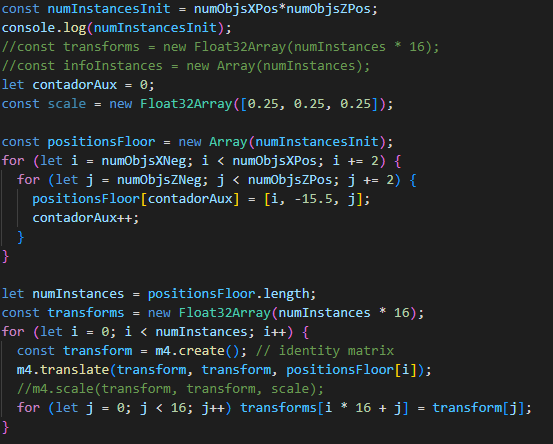
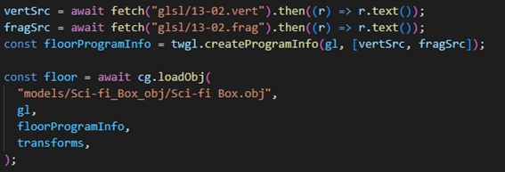
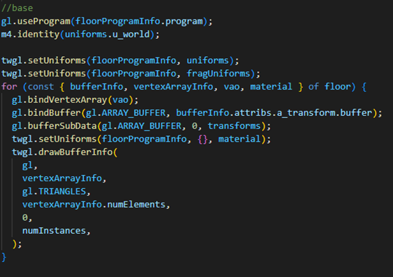

<h1>Trabajo Final - Informe </h1>

	

		
		
<b>Universidad Peruana de Ciencias Aplicadas (UPC)</b>

	

	

		
Computación Grafica

		
Prof. : <b>Luis Martin Canaval Sanchez Silva</b>

		
&nbsp;
 
		
Alumnos: <b>	
			 *	Nuñez Lazo, Sergio Antonio · U201910357
		</b>

		
Ciencias de la Computación

		
2022-01

	

&nbsp;

## Introducción

El trabajo presentado es una mejora al proyecto presentado en el trabajo parcial. Para este trabajo se pidió la implementación de distintos tipos de iluminación e instanciamiento.

## Objetivos

 - Modificar el código del trabajo parcial con el objetivo de añadir
   luces ambientales, especulares y difusas
 - Modificar la forma de carga de objetos, para este trabajo fue
   requisito el uso de modelos wavefront
 - Usar instanciamiento para 50000 o más instancias
 - Configurar el manejo de la cámara usando teclado

## Problema/ Caso desarrollado

El proyecto que se uso como base generaba un terreno procedural infinito, además de tener texturas. En ese proyecto también había objetos que se movían en el eje Y, además estos objetos tenían colisión simple. Como ya se menciono en el presente trabajo se modificó este proyecto para agregar todas las mejoras que liste en la sección de objetivos del trabajo.

## Descripción de la solución propuesta

Para este problema me apoye en la librería cg.ts que el profesor creo durante el proceso del ciclo académico, esta fue útil para la implementación de la cámara y del movimiento. En este proyecto use las instancias para poder generar el terreno, ya que esto ayuda a poder dibujar varios objetos sin gastar muchos recursos, esta mejora permitió generar un terreno más grande. Se utilizaron los shaders usados en la clase de la semana 14 para poder implementar las luces. Finalmente, no tuve que realizar cambios a la carga de objetos, ya que en el proyecto que usé como base ya había hecho uso de modelos wavefront.

## Desarrollo (incluir pantallazos y código de las principales funciones)

	

Creación de instancias para el terreno

	

Carga de objetos usando wavefront

	

Dibujo haciendo uso de instancias

## Conclusiones

Concluyo que este trabajo me ayudo de poner en practica los conocimientos aprendidos durante todo el ciclo, especialmente durante la segunda mitad del curso. Además, este trabajo me propuso el reto adicional de tener que ir cambiando un proyecto ya existente con el objetivo de mejorarlo.

## Anexos

Link Repositorio: https://github.com/sergionl/TF_Trabajo_Final

Link del video:
https://www.youtube.com/watch?v=0rwWL7kpOYw
